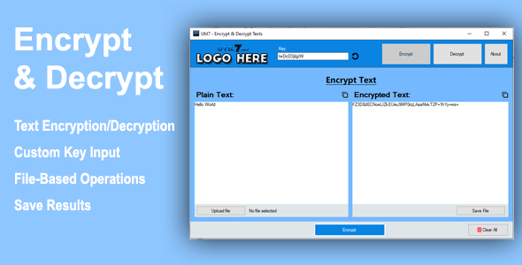

# Encrypt and Decrypt Text

Welcome to the **Encrypt and Decrypt Text** project! This tool, built with .NET Framework 4.8 and Windows Forms, provides a simple yet powerful solution for encrypting and decrypting text or files using custom keys.

## Table of Contents

- [Introduction](#introduction)
- [Package Contents](#package-contents)
- [Using the Application](#using-the-application)
- [Running the Source Code](#running-the-source-code)
- [Support](#support)
- [Contributions](#contributions)

## Introduction

Thank you for choosing **Encrypt and Decrypt Text**. This documentation will guide you through using the application and exploring its source code.

## Package Contents

Once extracted from the ZIP file, the following directories are available:

- **application**: Contains the pre-built executable ready for use.
- **sourcecode**: Contains the complete source code of the project.

## Using the Application

1. Navigate to the `application` folder.
2. Run the executable file. No additional installation is required.

## Running the Source Code

To run or modify the project using Visual Studio 2022:

1. Open Visual Studio 2022.
2. In the `sourcecode` folder, locate the `EncryptDecryptText.sln` file.
3. Double-click the solution file to open it.
4. Build and run the project:
    - Select **Build** > **Build Solution** (or press `Ctrl+Shift+B`).
    - Click **Start** to execute.

## Support

For issues or questions, please consult the provided documentation or contact us:

**Email**: support@util7.net

## Contributions

If you find this project helpful, consider buying me a coffee to support future developments! Every contribution is greatly appreciated.

